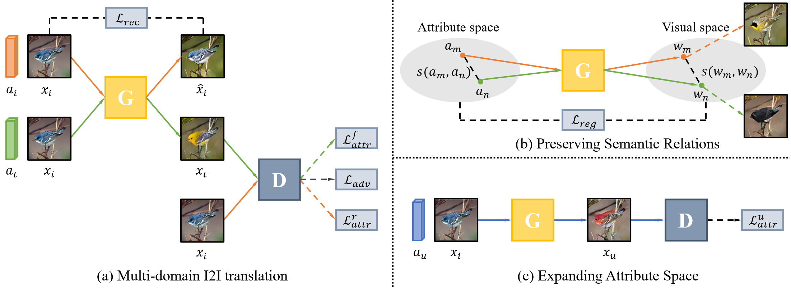
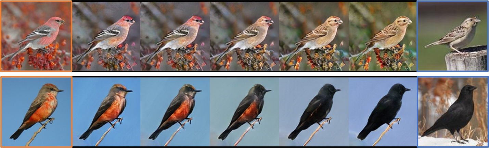

# ZUNIT

Pytorch implementation of our paper: ["Toward Zero-Shot Unsupervised Image-to-Image Translation"](https://arxiv.org/abs/2007.14050).

<p align="center">

</p>

### Dependencies
you can install all the dependencies  by
```
pip install -r requirements.txt
```

### Datasets
- Download [CUB](https://drive.google.com/file/d/1imQTOhiXlc1i9BnFQJD3XTFmroxCZlPQ/view?usp=sharing) dataset.
- Unzip the birds.zip at `./dataset`.

### Training
- To view training results and loss plots, run
```
python -m visdom.server -p 8080
```
and click the URL http://localhost:8080. 

- Run
```
bash ./scripts/train_bird.sh
```

### Testing
- Run
```
bash ./scripts/test_bird.sh
```
- The testing results will be saved in `checkpoints/{exp_name}/results` directory.

### Results
<p align="center">

</p>

<p align="center">

</p>

### Citation
If this work is useful for your research, please consider citing :
```
@article{chen2020toward,
  title={Toward Zero-Shot Unsupervised Image-to-Image Translation},
  author={Chen, Yuanqi and Yu, Xiaoming and Liu, Shan and Li, Ge},
  journal={arXiv preprint arXiv:2007.14050},
  year={2020}
}
```

### Acknowledgement
The code used in this research is inspired by [DMIT](https://github.com/Xiaoming-Yu/DMIT) and [FUNIT](https://github.com/NVlabs/FUNIT).

### Contact
Feel free to contact me if there is any questions (cyq373@pku.edu.cn).